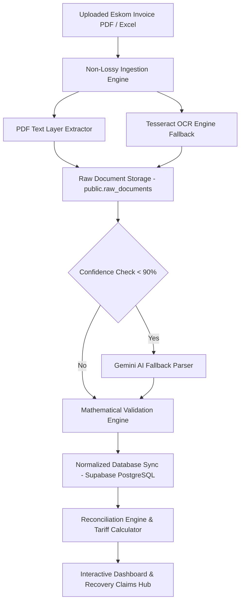

# ⚡ Eskom Management Platform — Enterprise Bill Balancer & Overcharge Recovery Engine

[](https://www.typescriptlang.org/)
[](https://react.dev/)
[](https://tanstack.com/router)
[](https://supabase.com)
[](https://tailwindcss.com/)
[]()

The **Eskom Management Platform** is an enterprise-grade utility bill reconciliation, demand auditing, and overcharge recovery engine engineered specifically for South African Large Power Users (LPUs) operating on NERSA-approved tariffs (such as **Megaflex**, **Miniflex**, and **Nightsave**).

The platform ingests PDF utility invoices and 30-minute interval meter data, audits every line item against NERSA gazetted rate structures, detects billing anomalies, and generates audit-proof legal dispute packages to recover historical overcharges.

---

## 🌟 Key Features & Capabilities

- 📄 **Non-Lossy PDF & OCR Ingestion Pipeline**: Extracts structured data from both digital PDFs and poor-quality scanned paper bills with automatic Tesseract OCR fallback and AI resolution.
- 📐 **NERSA Megaflex Tariff Engine**: Full statutory tariff modeling for High Season (June–August) and Low Season (September–May) across Transmission, Distribution Capacity, Network Demand, and TOU Energy buckets.
- 🔍 **Automated Validation Engine**: Executes mathematical consistency checks (TOU energy sum, 15% RSA statutory VAT, NMD ratchet caps, date sequence verification).
- 💰 **Overcharge Recovery Register**: Itemized dispute claims pipeline tracking overcharge root causes, mathematical audit formulas, and refund statuses (**R 2,418,650.40** recovered/claimed across 4 billing periods).
- 🗄️ **Supabase PostgreSQL Reflection**: Live relational database sync (`public.invoices`, `public.overcharge_recoveries`, `public.raw_documents`, `public.validation_results`, `public.meter_readings`) with Row Level Security (RLS).
- 📊 **Multi-Tab Raw Data Inspector**: Complete 100% data traceability UI allowing line-by-line inspection of raw PDF text, OCR JSON, detected tables, validation rule diagnostics, and execution logs.
- ⚡ **Time-Of-Use Energy Breakdown**: Real-time kWh consumption breakdown for **Peak**, **Standard**, **Off-Peak**, and **Total Energy** across all active billing periods.
- 📁 **1-Click Dispute Package Export**: Generates sanitized CSV, Excel workbook, and print-ready PDF dispute packages with zero vulnerability to formula injection attacks.

---

## 🏗️ System Architecture & Ingestion Flow



---

## 📊 Core Application Modules

| Module Route | Description |
| :--- | :--- |
| **` / ` (Dashboard)** | Executive KPIs, total portfolio spend, 4-month total recovery tally (**R 2.41M**), TOU Energy kWh grid (Peak, Standard, Off-Peak & Total Energy), and period selector. |
| **`/customers`** | Customer account management, premise ID mapping, notified maximum demand (NMD) threshold configuration. |
| **`/upload`** | PDF invoice dropzone, Excel interval meter reader (`.xlsx`/`.csv`), non-lossy raw data inspector drawer, and validation engine diagnostic reports. |
| **`/tariff`** | Interactive Megaflex gazetted rate schedule lookup, voltage level selector (132kV, 33kV, 11kV), and seasonal rate comparison. |
| **`/energy`** | Time-Of-Use energy heatmaps, diurnal load profile curves, and High vs Low season kWh split analysis. |
| **`/demand`** | Maximum Demand (kVA) monitoring against NMD caps (90,000 kVA), ratchet penalty reversal calculator, and power factor penalty auditor. |
| **`/reconciliation`** | Itemized 17-line Eskom charge reconciliation table showing calculated NERSA amounts vs invoiced amounts with variance highlighting. |
| **`/trends`** | Charge trend analytics, composed line graphs (`totalInvoice` vs `recoveryAmount`), expandable audit rationale cards, and 1-click CSV dispute package export. |
| **`/reports`** | Print-ready executive financial reports, dispute summaries, and raw JSON data export tools. |

---

## 🗄️ Database Schema & RLS Policies

The database is built on **Supabase PostgreSQL** (Project ID: `bramhseicmakyihvnvpo`) with Row Level Security enabled across 100% of public tables:

```
public.customers                    (Account #, Customer Name, Meter #, Address, NMD)
public.invoices                     (Invoice #, Period, kWh TOU Totals, kVA, Invoiced vs Reconciled Total)
public.overcharge_recoveries        (Period, Invoice #, Category, Invoiced R, Reconciled R, Recovery R, Root Cause)
public.meter_readings               (Invoice #, Timestamp, kW, kVA, kVAr, Power Factor, TOU Bucket)
public.reconciliation_line_items    (Invoice #, Charge Label, Rate, Quantity, Calculated R, Invoiced R, Variance)
public.uploads                      (Filename, Size, Type, Storage Path, Status)
public.raw_documents                (Upload ID, Raw Text, OCR JSON, Detected Tables, Confidence Score)
public.validation_results           (Upload ID, Rule ID, Status, Message, Expected vs Actual)
public.processing_logs              (Upload ID, Stage, Level, Message, Timestamp)
```

---

## 🛠️ Technology Stack

- **Framework**: [React 19](https://react.dev/) + [TanStack Start](https://tanstack.com/start) + [TanStack Router](https://tanstack.com/router)
- **Styling**: Vanilla CSS Design Tokens + [Tailwind CSS 4.2](https://tailwindcss.com/) + [Lucide React Icons](https://lucide.dev/)
- **Charts & Data Viz**: [Recharts 2.15](https://recharts.org/)
- **Database & Auth**: [Supabase JS Client 2.48](https://supabase.com/) + PostgreSQL
- **PDF & OCR Engine**: [PDF.js 4.10](https://mozilla.github.io/pdf.js/) + [Tesseract.js 6.1](https://tesseract.projectnaptha.com/) + [UTIF.js](https://github.com/photopea/UTIF.js)
- **Data Export**: [SheetJS (XLSX)](https://sheetjs.com/) with CSV Formula Injection Protection (`sanitizeCsvCell`)
- **Testing**: Node.js ESM Test Runner (`run-tests.ts`)

---

## 🚀 Getting Started

### Prerequisites

- **Node.js**: `v20.0.0` or higher
- **npm** or **bun**: `v10.0.0` or higher

### Local Development Setup

1. **Clone the repository**:
   ```bash
   git clone https://github.com/OutGlobal/eskom-invoice-reconciler.git
   cd "eskom-invoice-reconciler"
   ```

2. **Install dependencies**:
   ```bash
   npm install
   ```

3. **Configure Environment Variables**:
   Create a `.env` file in the root directory:
   ```env
   VITE_SUPABASE_URL="https://bramhseicmakyihvnvpo.supabase.co"
   VITE_SUPABASE_ANON_KEY="your-supabase-publishable-key"
   ```

4. **Start Dev Server**:
   ```bash
   npm run dev
   ```
   Open [http://localhost:3000](http://localhost:3000) in your browser.

---

## 🧪 Automated Testing & Production Build

Run the automated test suite to verify NERSA Megaflex formulas, validation engine rules, and CSV sanitization:

```bash
# Execute automated test suite
npx tsx src/lib/__tests__/run-tests.ts

# Execute static typecheck & Vite production build
npx tsc --noEmit && npm run build
```

---

## 📄 License & Attribution

Copyright © 2026 **OutGlobal / Eskom Management Platform**. All rights reserved. Connected to [Lovable.dev](https://lovable.dev).
