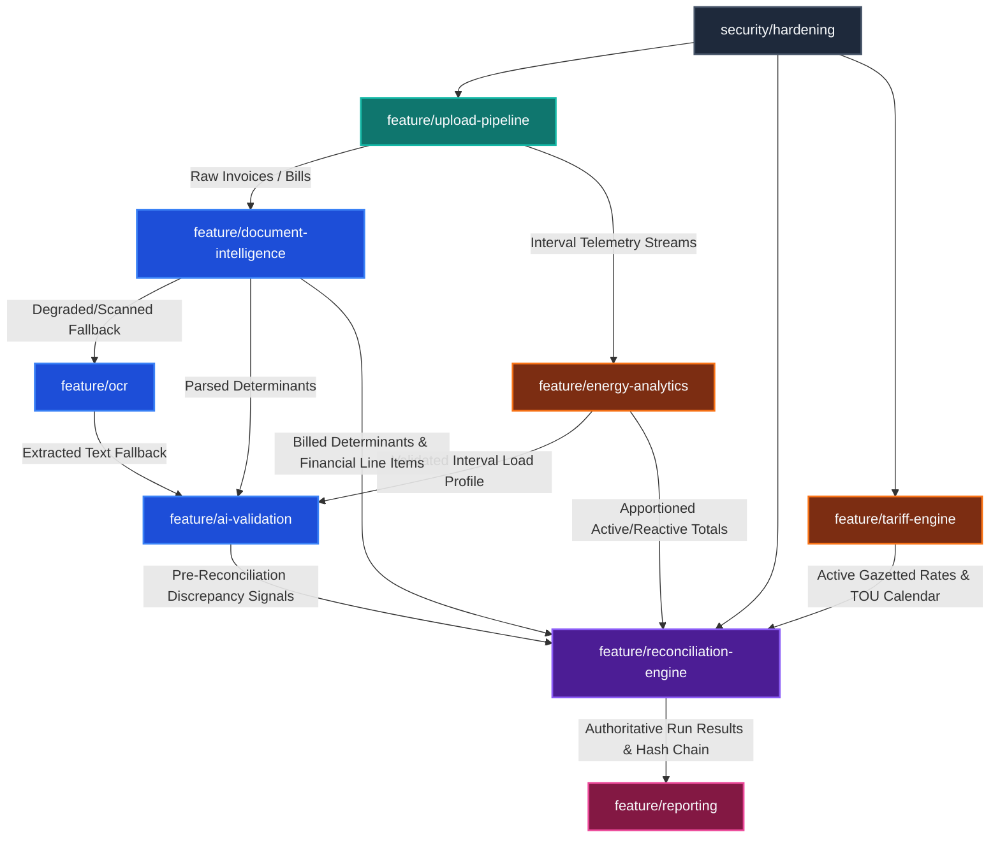

# ENERA Architectural Branch Dependency Graph

> **Engineering Standard & Development Boundaries**  
> **Status**: Active (Stage 18)  
> **Repository Integration Baseline**: `develop`

---

## 1. High-Level Subsystem Dependency Graph

```text
                                  ┌─────────────────────────┐
                                  │   security/hardening    │
                                  │ (Cross-Cutting Security)│
                                  └────────────┬────────────┘
                                               │
                                               ▼
                                  ┌─────────────────────────┐
                                  │ feature/upload-pipeline │
                                  │ (Raw File Ingestion)    │
                                  └──────┬───────────┬──────┘
                                         │           │
                     ┌───────────────────┘           └───────────────────┐
                     ▼                                                   ▼
       ┌───────────────────────────────┐                   ┌───────────────────────────────┐
       │ feature/document-intelligence │                   │   feature/energy-analytics    │
       │ (PDF Layout & Determinants)   │                   │ (AMR Telemetry Stream Engine) │
       └──────────────┬────────────────┘                   └───────────────┬───────────────┘
                      │                                                    │
                      ▼                                                    │
       ┌───────────────────────────────┐                                   │
       │         feature/ocr           │                                   │
       │  (Scanned / Image Fallback)   │                                   │
       └──────────────┬────────────────┘                                   │
                      │                                                    │
                      ▼                                                    │
       ┌───────────────────────────────┐                                   │
       │     feature/ai-validation     │◄──────────────────────────────────┤
       │ (Discrepancy Triage & Anomaly)│                                   │
       └──────────────┬────────────────┘                                   │
                      │                                                    │
                      │    ┌───────────────────────────────┐               │
                      │    │     feature/tariff-engine     │               │
                      │    │ (Tariff Models & TOU Calendar)│               │
                      │    └──────────────┬────────────────┘               │
                      │                   │                                │
                      ▼                   ▼                                ▼
       ┌───────────────────────────────────────────────────────────────────┐
       │                   feature/reconciliation-engine                   │
       │            (Authoritative Mathematical Discrepancy Core)          │
       └──────────────────────────────────┬────────────────────────────────┘
                                          │
                                          ▼
       ┌───────────────────────────────────────────────────────────────────┐
       │                         feature/reporting                         │
       │              (Dispute Packs, Audit Certificates & PDFs)           │
       └───────────────────────────────────────────────────────────────────┘
```

---

## 2. Mermaid Visual Flow



---

## 3. Detailed Branch Contract Specifications

### 1. `security/hardening`
* **Role**: Foundational platform security and governance.
* **Dependencies**: None (Root foundation).
* **Downstream Consumers**: All branches (`upload-pipeline`, `reconciliation-engine`, `tariff-engine`, `reporting`).
* **Artifacts & Contracts**:
  - Multi-tenant tenant context enforcement (`UserSecurityContext`).
  - Row-Level Security (RLS) policies on authoritative database tables.
  - SHA-256 cryptographic lineage and tamper-evident chaining.
  - Three-Tier Public Disclosure Sanitization (Strict Level 3 Zero-Exposure).

---

### 2. `feature/upload-pipeline`
* **Role**: Secure reception, storage vault persistence, and MIME integrity.
* **Dependencies**: `security/hardening`.
* **Downstream Consumers**: `feature/document-intelligence`, `feature/energy-analytics`.
* **Artifacts & Contracts**:
  - `UploadRecord`: Canonical database record tracking upload lifecycle (`UPLOADED` $\to$ `VALIDATING` $\to$ `PROCESSING` $\to$ `PROCESSED`).
  - Persistent vault storage in `source_files` bucket (`tenants/{orgId}/uploads/...`).
  - Anti-virus/anti-spoofing magic byte verification.
  - Exact file SHA-256 idempotency cache.

---

### 3. `feature/document-intelligence`
* **Role**: Deterministic PDF layout decomposition, table extraction, and determinant normalization.
* **Dependencies**: `feature/upload-pipeline` (consumes raw binary PDF streams).
* **Downstream Consumers**: `feature/ocr` (fallback trigger), `feature/ai-validation`, `feature/reconciliation-engine`.
* **Artifacts & Contracts**:
  - `ExtractedInvoiceData`: Account number, meter number, billing period start/end, notified maximum demand (NMD).
  - Billed determinant values: Peak kWh, Standard kWh, Off-Peak kWh, total kWh, max demand kVA, reactive energy kVArh.
  - Billed financial charges: Network charges, transmission, generation capacity, environmental levy, service charges, VAT.

---

### 4. `feature/ocr`
* **Role**: Fallback optical character recognition for scanned, distorted, or raster image documents.
* **Dependencies**: `feature/document-intelligence` (invoked when confidence $< 0.85$ or native digital text layer is absent).
* **Downstream Consumers**: `feature/ai-validation`, `feature/document-intelligence` (feeds back normalized text).
* **Artifacts & Contracts**:
  - Image binarization, de-skewing, and OCR text stream extraction.
  - Character and field-level confidence scoring.
  - Automated flag generation for manual human review (`REVIEW_REQUIRED`) when confidence thresholds fail.

---

### 5. `feature/tariff-engine`
* **Role**: Authoritative tariff modeling, TOU calendar scheduling, and rate lookups.
* **Dependencies**: `security/hardening` (tenant-isolated tariff stores).
* **Downstream Consumers**: `feature/reconciliation-engine`.
* **Artifacts & Contracts**:
  - `TariffDefinition`: Structured Eskom Megaflex, Nightsave, Miniflex, and municipal rate cards.
  - Time-of-Use (TOU) determinant calendar: High Season (June–August) vs Low Season (September–May).
  - Hourly slots: Peak, Standard, and Off-Peak allocations.
  - South African Standard Time (SAST) deterministic calendar engine with gazetted public holiday substitutions.

---

### 6. `feature/energy-analytics`
* **Role**: High-frequency interval telemetry aggregation and physical determinant derivation.
* **Dependencies**: `feature/upload-pipeline` (consumes raw AMR CSVs, XLSX sheets, and meter logs).
* **Downstream Consumers**: `feature/ai-validation`, `feature/reconciliation-engine`.
* **Artifacts & Contracts**:
  - `CanonicalEnergyRecord`: Clean, gap-repaired 30-minute interval series.
  - Physical determinant calculation: Active power ($kW$), reactive power ($kVAr$), apparent power ($kVA$).
  - Vector power factor calculation: $PF = \frac{kW}{kVA} = \frac{kW}{\sqrt{kW^2 + kVAr^2}}$.
  - Reactive energy surcharge thresholding ($>30\%$ of active energy during Peak & Standard hours).

---

### 7. `feature/ai-validation`
* **Role**: Deterministic anomaly detection, confidence triangulation, and discrepancy categorization.
* **Dependencies**:
  - `feature/document-intelligence` / `feature/ocr` (invoice determinants).
  - `feature/energy-analytics` (telemetry aggregates).
* **Downstream Consumers**: `feature/reconciliation-engine`.
* **Artifacts & Contracts**:
  - `ValidationIssue[]`: Mathematical discrepancy warnings, missing interval notifications, meter roll-over events.
  - Determinant cross-checks: Flagging differences between billed utility figures and physical meter readings.

---

### 8. `feature/reconciliation-engine`
* **Role**: The authoritative financial and engineering reconciliation core.
* **Dependencies**:
  - `feature/document-intelligence` (billed invoice determinants).
  - `feature/energy-analytics` (meter telemetry calculated baseline).
  - `feature/tariff-engine` (mandatory active tariff version and calendar rules).
  - `feature/ai-validation` (triaged discrepancy events).
  - `security/hardening` (cryptographic audit lineage & tenant context).
* **Downstream Consumers**: `feature/reporting`.
* **Artifacts & Contracts**:
  - `AuthoritativeReconciliationRun`: 14 core comparison determinants.
  - Financial variances (billed vs calculated energy, demand charges, network charges, surcharges, VAT).
  - Discrepancy classification: `PASS`, `TOLERABLE_VARIANCE`, `MATERIAL_DISCREPANCY`.
  - Cryptographic SHA-256 audit chaining: `reconciliation_run_snapshots`.

---

### 9. `feature/reporting`
* **Role**: Formal audit artifacts, statutory utility dispute packs, and executive visibility.
* **Dependencies**: `feature/reconciliation-engine` (requires final, immutable reconciliation run results).
* **Downstream Consumers**: External utility submission, finance department, executive dashboard.
* **Artifacts & Contracts**:
  - Formal Eskom dispute pack generation (PDF & Excel).
  - Cryptographic reconciliation certificates with verification hash.
  - Audit trail viewer and statutory submission packages.

---

## 4. Integration & Merge Order Rules

When integrating features back into `develop`, branches must be integrated strictly in dependency sequence:

1. `security/hardening` (Base security rules, context, and schemas)
2. `feature/upload-pipeline` (Raw ingestion capabilities)
3. `feature/document-intelligence` (Invoice parsing)
4. `feature/ocr` (Fallback scanner extraction)
5. `feature/energy-analytics` (Physical telemetry derivation)
6. `feature/tariff-engine` (Statutory rate models and TOU calendar)
7. `feature/ai-validation` (Discrepancy validation)
8. `feature/reconciliation-engine` (Authoritative calculation & audit)
9. `feature/reporting` (Dispute packs & audit export)
